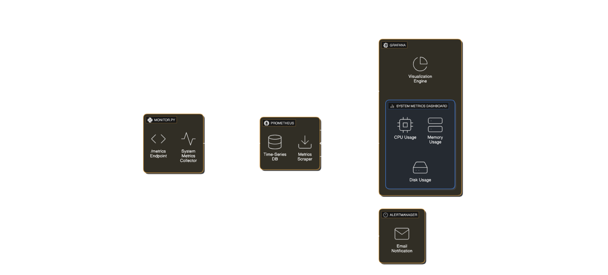

# Seaker-Alert-App: Linux Container Monitoring & Alert System

A system monitoring application for Linux containers, built with Python, Prometheus, and Grafana. Monitors CPU, RAM, disk, uptime, and temperature, with a Grafana dashboard and email alerts for threshold breaches.

---

## Features

- **Monitors:** CPU (%), RAM (GB), disk (GB), uptime (hours), temperature (°C)
- **Grafana Dashboard:** Real-time and historical data visualization
- **Email Alerts:** Configurable notifications for high CPU, RAM, low disk space, or high temperature
- **Dockerized:** All components containerized for easy deployment and management

---

## Architecture



- [`monitor.py`](monitor.py): Collects metrics and exposes them for Prometheus
- Prometheus: Time-series database and scraper
- Grafana: Dashboard and visualization
- Alertmanager (optional): Routes email alerts

---

## Prerequisites

- **Docker:** [Install Docker](https://docs.docker.com/get-docker/)
- **Docker Compose:** Included with Docker Desktop
- **Linux Container:** [`monitor.py`](monitor.py) is designed for Linux environments
- **SMTP Server:** Required for email alerts (e.g., Gmail with App Password)

---

## Setup

### 1. Clone the Repository

```sh
git clone https://github.com/your-username/Seaker-Alert-App.git
cd Seaker-Alert-App
```

### 2. Configure `config.yaml`

Edit [`config.yaml`](config.yaml) to set thresholds and email notification details:

```yaml
thresholds:
  cpu_percent: 80
  ram_used_percent: 80
  disk_used_percent: 80
  temperature_celsius: 70
email:
  smtp_server: "smtp.gmail.com"
  smtp_port: 587
  sender_email: "your-email@gmail.com"
  sender_password: "your-app-password"
  recipient_email: "recipient@example.com"
```

---

### 3. Run with Docker Compose

```sh
docker-compose up --build -d
```

This builds the monitor service, pulls Prometheus and Grafana images, and starts all services in detached mode.

---

## Dashboard Access

- **Local:** [http://localhost:3000](http://localhost:3000)
- **Server:** `http://<server-ip>:3000`

**Login:**
- Username: `admin`
- Password: `admin` (change on first login)

### Add Prometheus Data Source

1. In Grafana, go to **Configuration > Data sources**
2. Click **Add data source** and select **Prometheus**
3. Set URL to `http://prometheus:9090`
4. Click **Save & test**

### Import Dashboard

1. Go to **Dashboards > Import**
2. Upload [`grafana_dashboard.json`](grafana_dashboard.json)
3. Select Prometheus as the data source

---

## Viewing Data

- Dashboard updates every 5 seconds (based on [`monitor.py`](monitor.py) and Prometheus scrape interval)
- Use time range selector for historical data

---

## Alerts & Thresholds

Alerts are configured in Prometheus's alert.rules and routed via Alertmanager. Reference thresholds in [`config.yaml`](config.yaml):

```yaml
thresholds:
  cpu_percent: 80          # Alert if CPU usage > 80%
  ram_used_percent: 80     # Alert if RAM used > 80%
  disk_used_percent: 80    # Alert if Disk used > 80%
  temperature_celsius: 70  # Alert if Temperature > 70°C
```

*Note: RAM and disk percentages are calculated in Prometheus rules using metrics exposed by [`monitor.py`](monitor.py).*

---

## Restarting Services

- Restart monitor:  
  ```sh
  docker-compose restart monitor
  ```
- Restart Prometheus for new alert rules:
  ```sh
  docker-compose restart prometheus
  ```

---

## Testing Alerts

To simulate high CPU usage:

```sh
docker exec -it seaker-monitor-agent stress --cpu 4 --timeout 60s
```

*You may need to install `stress` inside the monitor container:*
```sh
apt-get update && apt-get install -y stress
```

---

## Live Demo (Cloud Deployment)

1. Provision a Linux VM (AWS EC2, Google Cloud, etc.)
2. Install Docker and Docker Compose
3. Clone the repository and follow setup steps
4. Open ports 3000, 8000, 9090 in firewall/security groups
5. Access Grafana at `http://<server-ip>:3000`
6. Simulate alerts and update thresholds as above

---

## Repository & Images

- GitHub: https://github.com/your-username/Seaker-Alert-App
- Docker Hub (optional): `docker pull your-username/seaker-alert-app:latest`

*Note: These links